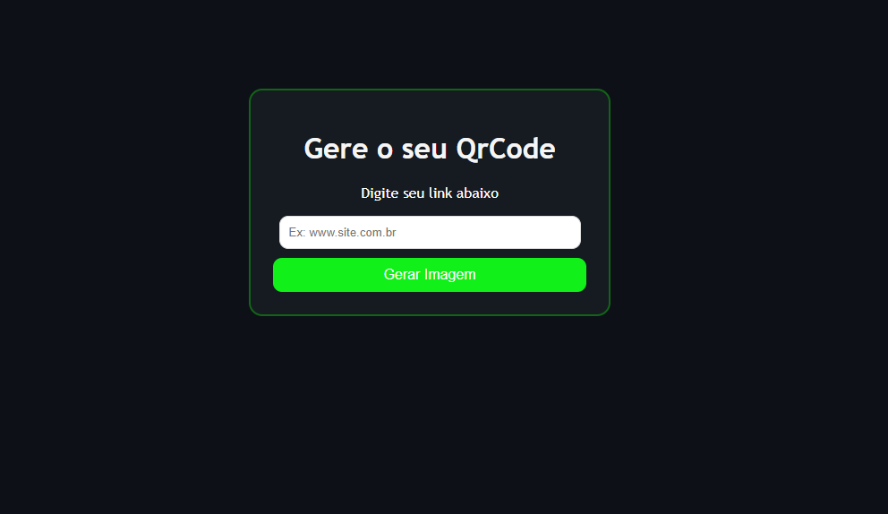

# Gerador-de-QrCode
Pequeno projeto realizado em meus estudos sobre Flask

**🚀 Gerador de QR Code Instantâneo**

## Sobre o projeto

Um projeto prático de desenvolvimento web focado em resolver um problema real e comum: gerar QR Codes para compartilhamento rápido de links e textos.
A aplicação recebe um link ou texto do usuário e devolve uma imagem qr code, gerada utilizando processamento em memória.

📸 Preview

## 🛠 Tecnologias Utilizadas

Este projeto foi desenvolvido para consolidar conhecimentos em Back-end e integração Web:

**Python** - Lógica e processamento.

**Flask** - Framework web para rotas e requisições HTTP.

**QRCode** - Biblioteca para geração da matriz gráfica.

**BytesIO** - Manipulação de arquivos em memória RAM (Buffer).

**HTML5 & CSS3** - Marcação e estilização da interface.

## Aprendizados

Durante o desenvolvimento deste projeto (primeiro em meus estudos com Flask), pude compreender conceitos fundamentais da web:

* Rotas e Métodos HTTP: A diferença prática entre GET e POST.
* Manipulação de Arquivos em Memória: Como usar BytesIO para servir arquivos dinâmicos sem precisar salvar fisicamente no HD.

